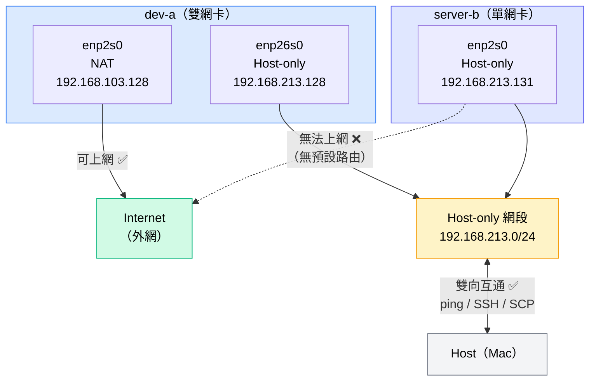

# W02｜VMware 網路模式與雙 VM 排錯

## 網路配置

| VM | 網卡 | 模式 | IP | 用途 |
|---|---|---|---|---|
| dev-a | enp2s0 | NAT | 192.168.103.128 | 上網 |
| dev-a | enp26s0 | Host-only | 192.168.213.128 | 內網互連 |
| server-b | enp2s0 | Host-only | 192.168.213.131 | 內網互連 |

---

## NAT / Bridged / Host-only 三種模式差異

- **NAT**：VM 透過 VMware 的 NAT 引擎共用 Host 的 IP 上網，外部無法主動連入 VM。適合需要上網但不需要被外部存取的情境。
- **Bridged**：VM 直接橋接到 Host 的實體網卡，拿到與 Host 同網段的 IP，區網內其他設備可以直接看到這台 VM。在共用網路環境中容易產生網段衝突。
- **Host-only**：VM 只能與 Host 及同網段其他 VM 通訊，無法上網。IP 不受外部 DHCP 影響，穩定性高，適合做隔離的實驗內網。

---

## 為什麼採用 NAT + Host-only 雙網卡設計

單一模式無法同時滿足「上網」和「VM 互連」兩個需求。使用 NAT 單網卡時，VM 之間的互通要繞過 NAT 引擎，不夠直接也不穩定；使用 Host-only 單網卡時，VM 之間可以互通但無法上網安裝套件。雙網卡設計讓 NAT 負責外網、Host-only 負責內網，職責分離，各管各的。

`server-b` 只設 Host-only 而不給 NAT，是因為它的角色是內網服務機，不需要直接對外上網，這樣也讓它完全隔離在可控的內網環境中，符合最小權限原則。

---

## 連線驗證紀錄

- [x] dev-a NAT 可上網：`ping -c 4 8.8.8.8` 及 `ping -c 4 google.com` 成功，有 `default via 192.168.103.2 dev enp2s0` 預設路由
- [x] 雙向互 ping 成功：dev-a ping 192.168.213.131 成功；server-b ping 192.168.213.128 成功
- [x] SSH 連線成功：`ssh tt@192.168.213.131 "hostname"` 回傳 `server-b`
- [x] SCP 傳檔成功：`cat /tmp/test-from-dev.txt` 在 server-b 上回傳 `Hello from dev-a`
- [x] server-b 不能上網：`ping -c 4 8.8.8.8` 失敗，`ip route show` 無預設路由

---

## 故障演練一：介面停用

| 項目 | 故障前 | 故障中 | 回復後 |
|---|---|---|---|
| server-b 介面狀態 | UP | DOWN | UP |
| dev-a ping server-b | 成功 | 失敗（timeout） | 成功 |
| dev-a SSH server-b | 成功 | 失敗（無法連線） | 成功 |

**操作紀錄：**
```bash
# 故障注入（在 server-b）
sudo ip link set enp2s0 down

# 觀測故障（在 dev-a）
ping -c 4 192.168.213.131      # 失敗
ssh tt@192.168.213.131 "hostname" 2>&1  # 失敗

# 回復（在 server-b）
sudo ip link set enp2s0 up
sleep 5
ip address show enp2s0         # 確認 IP 不變（192.168.213.131）

# 驗證回復（在 dev-a）
ping -c 4 192.168.213.131      # 成功
ssh tt@192.168.213.131 "hostname"  # 回傳 server-b
```

---

## 故障演練二：SSH 服務停止

| 項目 | 故障前 | 故障中 | 回復後 |
|---|---|---|---|
| ss -tlnp \| grep :22 | 有監聽（0.0.0.0:22） | 無監聽 | 有監聽 |
| dev-a ping server-b | 成功 | 成功 | 成功 |
| dev-a SSH server-b | 成功 | Connection refused | 成功 |

**操作紀錄：**
```bash
# 故障注入（在 server-b）
sudo systemctl stop ssh.socket
sudo systemctl stop ssh
ss -tlnp | grep :22            # 無輸出，確認停止

# 觀測故障（在 dev-a）
ping -c 2 192.168.213.131      # 成功（L3 正常）
ssh tt@192.168.213.131 "hostname" 2>&1  # Connection refused（L4 故障）

# 回復（在 server-b）
sudo systemctl start ssh
ss -tlnp | grep :22            # 確認恢復監聽

# 驗證回復（在 dev-a）
ssh tt@192.168.213.131 "hostname"  # 回傳 server-b
```

---

## 排錯順序（L2 → L3 → L4）

排錯必須由下往上逐層進行，不跳層：

**L2（介面層）** — 先確認網卡有沒有起來、有沒有 IP：
```bash
ip address show
```
如果介面是 DOWN 或沒有 IP，從這層修，不用往上查。

**L3（網路層）** — 確認路由正確，封包能到達對端：
```bash
ip route show
ping -c 4 <對端 IP>
```
沒有預設路由或 ping 不通，就是 L3 的問題。

**L4+（傳輸/服務層）** — 確認服務有在監聽、連線不被擋：
```bash
ss -tlnp | grep :22
ssh <user>@<IP> "hostname"
```
ping 通但 SSH 被拒，才是 L4 的問題（服務沒開或防火牆擋住）。

---

## 網路拓樸圖



**流量方向：**
- `dev-a enp2s0` → Internet：可通（NAT）
- `dev-a` ↔ `server-b`：可通（同屬 192.168.213.0/24 Host-only 網段）
- `server-b` → Internet：不通（無 NAT 網卡、無預設路由）

---

## 排錯紀錄

**症狀：** 停止 SSH 服務時，執行 `sudo systemctl stop ssh` 出現警告 `Stopping 'ssh.service', but its triggering units are still active: ssh.socket`，SSH 看起來還沒完全停止。

**診斷：** 用 `ss -tlnp | grep :22` 確認 port 22 狀態，發現 `ssh.socket` 仍在接管連線，所以光停 ssh.service 不夠。

**修正：** 改為同時停止 socket 和 service：
```bash
sudo systemctl stop ssh.socket
sudo systemctl stop ssh
```

**驗證：** 再執行 `ss -tlnp | grep :22`，無任何輸出，確認 port 22 已完全停止監聽。

---

## 設計決策

**為什麼 server-b 只設 Host-only 不給 NAT？**

server-b 的角色是內網服務機，由 dev-a 透過 SSH 管理。給它 NAT 網卡雖然可以直接上網，但也代表它有對外的出口，攻擊面變大，且實驗環境的目的是讓網路行為可控、可重現。只保留 Host-only 可以確保 server-b 完全在隔離的內網中，任何對外需求都由 dev-a 代為處理（例如用 SCP 傳安裝包），符合最小權限設計原則。

---

## 可重跑最小命令鏈

```bash
ip address show
ip route show
ping -c 2 192.168.213.131
ss -tlnp | grep :22
ssh tt@192.168.213.131 "hostname"
```
