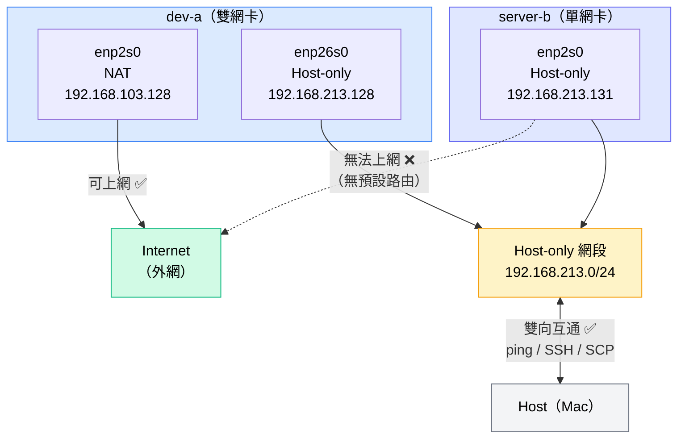

# W02｜網路拓樸圖

## 說明

| VM | 網卡 | 模式 | IP | 可上網 |
|---|---|---|---|---|
| dev-a | enp2s0 | NAT | 192.168.103.128 | ✅ |
| dev-a | enp26s0 | Host-only | 192.168.213.128 | ❌ |
| server-b | enp2s0 | Host-only | 192.168.213.131 | ❌ |

**流量方向：**
- `dev-a enp2s0` → Internet：可通（NAT）
- `dev-a` ↔ `server-b`：可通（同屬 192.168.213.0/24 Host-only 網段）
- `server-b` → Internet：不通（無 NAT 網卡、無預設路由）
