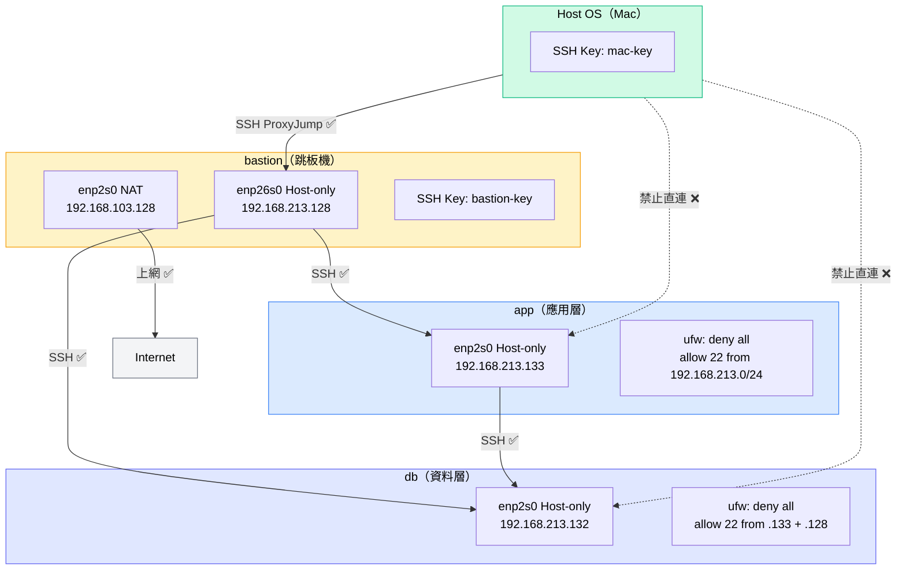

# W03｜多 VM 架構：分層管理與最小暴露設計

## 網路配置

| VM | 角色 | 網卡 | 模式 | IP | 開放埠與來源 |
|---|---|---|---|---|---|
| bastion | 跳板機 | enp2s0 | NAT | 192.168.103.128 | 上網用 |
| bastion | 跳板機 | enp26s0 | Host-only | 192.168.213.128 | SSH from any |
| app | 應用層 | enp2s0 | Host-only | 192.168.213.133 | SSH from 192.168.213.0/24 |
| db | 資料層 | enp2s0 | Host-only | 192.168.213.132 | SSH from app + bastion |

---

## 分層架構與最小暴露原則

本週架構分三層：bastion 是唯一對外開放 SSH 的入口，app 和 db 躲在 Host-only 內網，只能透過 bastion 跳板進入。

最小暴露原則的意思是：每台機器只開放它角色需要的埠和連線來源，不需要對外就不對外。攻擊面越小，能被攻擊的入口就越少。bastion 集中管控所有管理流量，即使某台內網機器有漏洞，攻擊者也無法從外部直接存取，必須先突破 bastion 這一關。

防火牆規則越靠內層越嚴格：
- bastion：SSH 對外開放（它是入口）
- app：只允許 Host-only 網段（192.168.213.0/24）連 SSH
- db：只允許 app 和 bastion 的 IP 連 SSH

---

## SSH 金鑰認證

- 金鑰類型：ed25519
- 公鑰部署到：app 和 db 的 `~/.ssh/authorized_keys`，以及 bastion、app、db 的 `authorized_keys`（Mac 的金鑰）

### 免密碼登入驗證

```
# bastion → app
tt@bastion:~$ ssh tt@192.168.213.133 "echo '金鑰認證成功'"
金鑰認證成功

# bastion → db
tt@bastion:~$ ssh tt@192.168.213.132 "echo '金鑰認證成功'"
金鑰認證成功

# Mac → bastion / app / db
apple@AppledeMacBook-Pro ~ % ssh bastion "hostname"
bastion
apple@AppledeMacBook-Pro ~ % ssh app "hostname"
app
apple@AppledeMacBook-Pro ~ % ssh db "hostname"
db
```

---

## 防火牆規則

### app 的 ufw status

```
Status: active
Logging: on (low)
Default: deny (incoming), allow (outgoing), deny (routed)
New profiles: skip

To                         Action      From
--                         ------      ----
22/tcp                     ALLOW IN    192.168.213.0/24
```

### db 的 ufw status

```
Status: active
Logging: on (low)
Default: deny (incoming), allow (outgoing), deny (routed)
New profiles: skip

To                         Action      From
--                         ------      ----
22/tcp                     ALLOW IN    192.168.213.133
22/tcp                     ALLOW IN    192.168.213.128
```

### 防火牆確實在擋的證據

在 app 上啟動 HTTP server 監聽 8080，從 bastion 嘗試連線：

```
tt@bastion:~$ curl -m 5 http://192.168.213.133:8080 2>&1
curl: (28) Connection timed out after 5007 milliseconds
```

ufw 只允許 port 22，8080 被靜默丟棄，出現 `Connection timed out`。

---

## ProxyJump 跳板連線

### SSH config 設定（在 Mac 上）

```
Host bastion
    HostName 192.168.213.128
    User tt

Host app
    HostName 192.168.213.133
    User tt
    ProxyJump bastion

Host db
    HostName 192.168.213.132
    User tt
    ProxyJump bastion
```

### 驗證輸出

```
apple@AppledeMacBook-Pro ~ % ssh app "hostname"
app
apple@AppledeMacBook-Pro ~ % ssh db "hostname"
db
```

### SCP 傳檔驗證

```
apple@AppledeMacBook-Pro ~ % scp /tmp/proxy-test.txt app:/tmp/
proxy-test.txt    100%   24    36.8KB/s   00:00
apple@AppledeMacBook-Pro ~ % scp /tmp/proxy-test.txt db:/tmp/
proxy-test.txt    100%   24    27.1KB/s   00:00
apple@AppledeMacBook-Pro ~ % ssh app "cat /tmp/proxy-test.txt"
Test file via ProxyJump
apple@AppledeMacBook-Pro ~ % ssh db "cat /tmp/proxy-test.txt"
Test file via ProxyJump
```

---

## 故障場景一：防火牆全封鎖

| 項目 | 故障前 | 故障中 | 回復後 |
|---|---|---|---|
| app ufw status | active + allow 22 from 192.168.213.0/24 | deny all incoming + deny all outgoing | active + allow 22 from 192.168.213.0/24 |
| bastion ping app | 成功 | 成功（ICMP 未被擋） | 成功 |
| bastion SSH app | 成功 | **Connection timed out** | 成功 |

### 操作紀錄

```bash
# 故障注入（在 app VMware console）
sudo ufw reset
sudo ufw default deny incoming
sudo ufw default deny outgoing
sudo ufw enable

# 觀測（在 bastion）
ping -c 4 192.168.213.133           # 成功
ssh -o ConnectTimeout=5 tt@192.168.213.133 "hostname" 2>&1
# ssh: connect to host 192.168.213.133 port 22: Connection timed out

# 回復（在 app VMware console）
sudo ufw reset
sudo ufw default deny incoming
sudo ufw default allow outgoing
sudo ufw allow from 192.168.213.0/24 to any port 22 proto tcp
sudo ufw enable

# 驗證（在 bastion）
ssh tt@192.168.213.133 "hostname"   # app
```

---

## 故障場景二：SSH 服務停止

| 項目 | 故障前 | 故障中 | 回復後 |
|---|---|---|---|
| ss -tlnp \| grep :22 | 有監聽（0.0.0.0:22） | 無監聽 | 有監聽 |
| bastion ping app | 成功 | 成功 | 成功 |
| bastion SSH app | 成功 | **Connection refused** | 成功 |

### 操作紀錄

```bash
# 故障注入（在 app）
sudo systemctl stop ssh.socket
sudo systemctl stop ssh
ss -tlnp | grep :22    # 無輸出

# 觀測（在 bastion）
ping -c 2 192.168.213.133           # 成功（L3 正常）
ssh -o ConnectTimeout=5 tt@192.168.213.133 "hostname" 2>&1
# ssh: connect to host 192.168.213.133 port 22: Connection refused

# 回復（在 app）
sudo systemctl start ssh
ss -tlnp | grep :22    # 確認恢復監聽

# 驗證（在 bastion）
ssh tt@192.168.213.133 "hostname"   # app
```

---

## timeout vs refused 差異

| 症狀 | 原因 | 排錯方向 |
|---|---|---|
| `Connection timed out` | 封包被防火牆靜默丟棄，沒有任何回應 | L3.5 → 查 `sudo ufw status` |
| `Connection refused` | 目標埠沒有服務在監聽，對方回了 RST | L4 → 查 `ss -tlnp` |

`timeout` 是封包「石沉大海」，沒有人回應；`refused` 是有人回應說「這個門沒開」。排錯時看到 timeout 先查防火牆，看到 refused 先查服務有沒有跑。

---

## 網路拓樸圖



---

## 排錯紀錄

**症狀：** 從 Mac 執行 `ssh bastion "hostname"` 出現 `Connection refused`。

**診斷：** 在 bastion 上執行 `sudo systemctl status ssh`，回傳 `Unit ssh.service could not be found`，確認 bastion 從未安裝 openssh-server（W02 時 dev-a 扮演客戶端角色，當時沒裝）。

**修正：**
```bash
sudo apt update
sudo apt -y install openssh-server
sudo systemctl enable ssh
sudo systemctl start ssh
```

**驗證：** `ss -tlnp | grep :22` 確認 port 22 在監聽，再從 Mac 執行 `ssh bastion "hostname"` 成功回傳 `bastion`。

---

## 設計決策

**為什麼 db 允許 bastion 直連，而不是只允許從 app 跳？**

如果 db 只允許 app 連，當 app 出問題（例如服務掛掉、被入侵），管理員就無法直接從 bastion SSH 進 db 排錯，會造成管理盲點。讓 bastion 也能直連 db，保留了緊急管理的通道，同時 db 仍然完全隔離在內網，外部無法直接存取。這是在「最小暴露」和「可管理性」之間的取捨。

---

## 可重跑最小命令鏈

```bash
ip address show
sudo ufw status
ssh tt@192.168.213.133 "hostname"
ssh -J tt@192.168.213.128 tt@192.168.213.133 "hostname"
```
