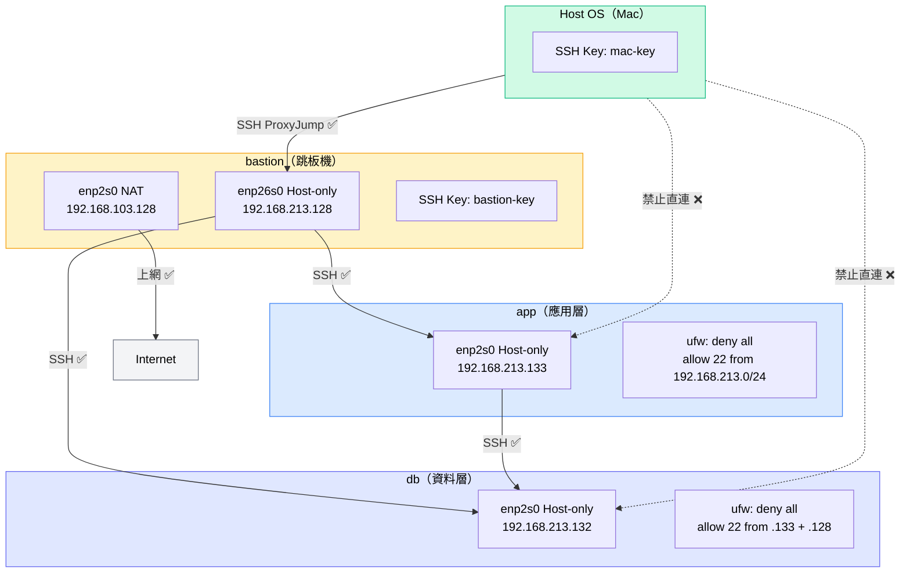

# W03｜網路拓樸圖



## 說明

| VM | 角色 | 網卡 | 模式 | IP | 防火牆 |
|---|---|---|---|---|---|
| bastion | 跳板機 | enp2s0 | NAT | 192.168.103.128 | 無限制 |
| bastion | 跳板機 | enp26s0 | Host-only | 192.168.213.128 | 無限制 |
| app | 應用層 | enp2s0 | Host-only | 192.168.213.133 | allow 22 from 192.168.213.0/24 |
| db | 資料層 | enp2s0 | Host-only | 192.168.213.132 | allow 22 from .133 + .128 only |

**流量方向：**
- `bastion enp2s0` → Internet：可通（NAT）
- `Mac` → `bastion`：可通（SSH）
- `Mac` → `app` / `db`：透過 ProxyJump 跳板可通，禁止直連
- `bastion` ↔ `app`：可通（Host-only 同網段 + ufw 允許）
- `bastion` ↔ `db`：可通（Host-only 同網段 + ufw 允許）
- `app` → `db`：可通（ufw 允許 app IP）
- `app` / `db` → Internet：不通（無 NAT 網卡、無預設路由）
```
