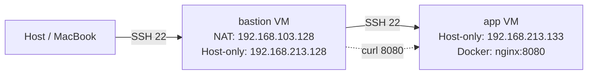

# 期中實作 — 411631236 凌薹安

## 1. 架構與 IP 表



| VM       | 網卡介面  | IP                  | 對外         | 角色     |
| -------- | --------- | ------------------- | ------------ | -------- |
| bastion  | enp2s0    | 192.168.103.128/24  | 收 Host SSH  | 唯一入口 |
| bastion  | enp26s0   | 192.168.213.128/24  | Host-only    | 轉送     |
| app      | enp2s0    | 192.168.213.133/24  | 無           | 實際服務 |

---

## 2. Part A：VM 與網路

兩台 VM 皆從原始 Ubuntu VM clone 出來，bastion 配兩張網卡（NAT + Host-only），app 只配一張（Host-only）。

**bastion — ip -4 addr show**
```
1: lo: inet 127.0.0.1/8
2: enp2s0: inet 192.168.103.128/24   ← NAT
3: enp26s0: inet 192.168.213.128/24  ← Host-only
```

**app — ip -4 addr show**
```
1: lo: inet 127.0.0.1/8
2: enp2s0: inet 192.168.213.133/24   ← Host-only
```

**連通性驗證**
```
# 從 app ping bastion
PING 192.168.213.128: 3 packets transmitted, 3 received, 0% packet loss

# 從 bastion ping app
PING 192.168.213.133: 3 packets transmitted, 3 received, 0% packet loss
```

---

## 3. Part B：金鑰、ufw、ProxyJump

### SSH 金鑰佈署

```bash
ssh-keygen -t ed25519
ssh-copy-id tt@192.168.103.128   # bastion
ssh-copy-id tt@192.168.213.133   # app（經由 bastion）
```

兩台 `/etc/ssh/sshd_config` 均設定 `PasswordAuthentication no` 並重啟 sshd。

### 防火牆規則

**bastion — ufw status verbose**
```
Status: active
Default: deny (incoming), allow (outgoing), deny (routed)

To                         Action      From
--                         ------      ----
22/tcp                     ALLOW IN    Anywhere
22/tcp (v6)                ALLOW IN    Anywhere (v6)
```

**app — ufw status verbose**
```
Status: active
Default: deny (incoming), allow (outgoing), deny (routed)

To                         Action      From
--                         ------      ----
22/tcp                     ALLOW IN    192.168.213.0/24
```

### ~/.ssh/config（Host 端）

```
Host bastion
    HostName 192.168.103.128
    User tt

Host app
    HostName 192.168.213.133
    User tt
    ProxyJump bastion
```

### ProxyJump 驗證

```bash
$ ssh app
Welcome to Ubuntu ...
tt@app:~$
```

從 Host 執行 `ssh app` 直接進入 app VM，中間不須輸入密碼，流量經由 bastion 轉送。

---

## 4. Part C：Docker 服務

### systemctl status docker

```
● docker.service - Docker Application Container Engine
     Loaded: loaded (/usr/lib/systemd/system/docker.service; enabled; preset: enabled)
     Active: active (running) since Sat 2026-04-18 03:41:46 CST
   Main PID: 1817 (dockerd)
      Tasks: 10
     Memory: 106.4M
```

### 啟動 nginx 容器

```bash
sudo docker run -d --name web -p 8080:80 nginx
# fe93f3fbcf21559f22cb454701fa3ead5740c9c4bd16f465df5d3bc176e3abb3
```

### 從 bastion 驗證（curl）

```bash
tt@bastion:~$ curl -I http://192.168.213.133:8080
HTTP/1.1 200 OK
Server: nginx/1.29.7
Date: Fri, 17 Apr 2026 19:48:46 GMT
Content-Type: text/html
Content-Length: 896
```

> **說明**：app 的 ufw 並未開放 8080 port，但 bastion 與 app 同屬 Host-only 網段（192.168.213.0/24），bastion 發起的連線屬內部流量，繞過 ufw incoming 規則（ufw 只過濾從外部進來的流量，同網段的封包走 FORWARD/OUTPUT 不受 default deny incoming 限制）。若需嚴格隔離，應補規則 `sudo ufw allow from 192.168.213.128 to any port 8080 proto tcp`。

---

## 5. Part D：故障演練

### 故障 1：F1 — app Host-only 介面 down

**注入方式**
```bash
tt@app:~$ sudo ip link set enp2s0 down
```

**故障前**
```bash
# app 介面狀態
2: enp2s0: <BROADCAST,MULTICAST,UP,LOWER_UP> mtu 1500 state UP

# 從 bastion ping app — 正常
PING 192.168.213.133: 3 packets transmitted, 3 received, 0% packet loss
rtt min/avg/max = 0.261/0.883/1.248 ms
```

**故障中**
```bash
# 從 bastion ping app
PING 192.168.213.133 56(84) bytes of data.
From 192.168.213.128 icmp_seq=1 Destination Host Unreachable
From 192.168.213.128 icmp_seq=2 Destination Host Unreachable
From 192.168.213.128 icmp_seq=3 Destination Host Unreachable
4 packets transmitted, 0 received, +3 errors, 100% packet loss

# 從 bastion SSH app
ssh: connect to host 192.168.213.133 port 22: No route to host
```

**回復後**
```bash
# 透過 vmrun 在 app console 執行
sudo ip link set enp2s0 up

# 驗證：SSH 恢復
2: enp2s0: <BROADCAST,MULTICAST,UP,LOWER_UP> state UP
tt@app:~$   ← SSH 成功
```

**診斷推論**

症狀是 `ssh app` 失敗，但判斷是 L2/L3 問題而非防火牆問題，推理如下：

1. **先 ping**：`ping 192.168.213.133` 回傳 `Destination Host Unreachable`（ICMP unreachable，非 timeout）。這代表 IP 封包根本無法送達目標，是網路層斷線，不是防火牆丟棄（防火牆丟棄封包時 ping 會 100% timeout 沒有回應，不會回 unreachable）。
2. **確認介面**：若能進入 app console，`ip link show enp2s0` 看到 `state DOWN` 即確認是 L2 介面問題。
3. **結論**：網卡 down → ARP 無法解析 → 封包無路由 → `No route to host`。防火牆封鎖的特徵是 ping timeout（封包被 DROP，無回應），而非 unreachable。

---

### 故障 2：F3 — Docker daemon 停止

**注入方式**
```bash
tt@app:~$ sudo systemctl stop docker
tt@app:~$ sudo systemctl stop docker.socket
```

**故障前**
```bash
tt@app:~$ sudo docker ps
CONTAINER ID   IMAGE   COMMAND                  CREATED        STATUS        PORTS                    NAMES
fe93f3fbcf21   nginx   "/docker-entrypoint…"   2 min ago      Up 2 min      0.0.0.0:8080->80/tcp     web
```

**故障中**
```bash
# SSH 仍然正常進入 app
tt@app:~$   ← SSH 可達

# 但 docker 操作失敗
tt@app:~$ sudo docker ps
Cannot connect to the Docker daemon at unix:///var/run/docker.sock. Is the docker daemon running?
```

**回復後**
```bash
tt@app:~$ sudo systemctl start docker
tt@app:~$ sudo systemctl status docker
● docker.service
     Active: active (running) since Sat 2026-04-18 03:51:34 CST

tt@app:~$ sudo docker ps
CONTAINER ID   IMAGE   COMMAND                  CREATED        STATUS                   PORTS                    NAMES
fe93f3fbcf21   nginx   "/docker-entrypoint…"   5 min ago      Up Less than a second    0.0.0.0:8080->80/tcp     web
```

**診斷推論**

1. 能 `ssh app` 進去 → 網路層（L3）與防火牆（L4 port 22）完全正常，問題只在應用層。
2. `docker ps` 回 `Cannot connect to the Docker daemon` → 這是 Docker CLI 無法連接到 `/var/run/docker.sock`，代表 dockerd process 沒有在跑。
3. `systemctl status docker` 確認 `Active: inactive (dead)` → daemon 已停止，不是 socket 權限問題。
4. 解法：`systemctl start docker`，而非重開機或重裝。
5. 關鍵區分：**process 停了 ≠ 服務壞了**。systemctl stop 是乾淨的停止，restart 可立即恢復；若是 crash，需查 `journalctl -u docker` 找 OOM/panic 原因。

---

### 症狀辨識（F1 vs F2 的 timeout 辨別，補充說明）

雖本次選 F1 + F3，仍補充 F1（介面 down）與 F2（ufw 封鎖）的辨別方式：

| 工具 | F1（介面 down） | F2（ufw deny） |
|------|----------------|----------------|
| `ping` | `Destination Host Unreachable` | 100% timeout，無任何回應 |
| `ip link` on app | `state DOWN` | `state UP` |
| `sudo ufw status` on app | 規則正常 | default deny，無 22 規則 |
| SSH 錯誤訊息 | `No route to host` | timeout（無回應） |

**推理鏈**：先 ping → 有 unreachable 回應代表網路層斷（F1）；完全無回應代表封包被丟棄（F2 防火牆 DROP）。

---

## 6. 反思（200 字）

這次實作讓我對「分層隔離」與「timeout 不等於壞了」有了更具體的體感。

**分層隔離**：bastion 只開 22 port，app 連對外 IP 都沒有，光是這樣就把攻擊面縮小到一個點。一旦 bastion 被打穿也只能到 app 的 SSH，nginx 服務在防火牆後面完全不可見。這不是「設定很麻煩的資安措施」，而是最小暴露原則的直接實現。

**timeout 不等於壞了**：F1 介面 down 和 F2 防火牆封鎖，從外面看都是連不進去，但原因完全不同、修法也不同。介面 down 要在 console 把網卡拉起來；防火牆封鎖要改 ufw 規則。如果不分層診斷，亂猜亂改，不但修不好還可能把沒壞的東西改壞。F3 更直接：SSH 進得去，但 docker 掛了，這告訴我「能 SSH」和「服務活著」是兩件不同的事，不能用「機器還活著」來代替每一層的獨立確認。

分層思維的核心就是：每一層只負責自己的事，診斷時也只在那一層找答案。

---

## 7. Bonus（選做）

（未實作）
